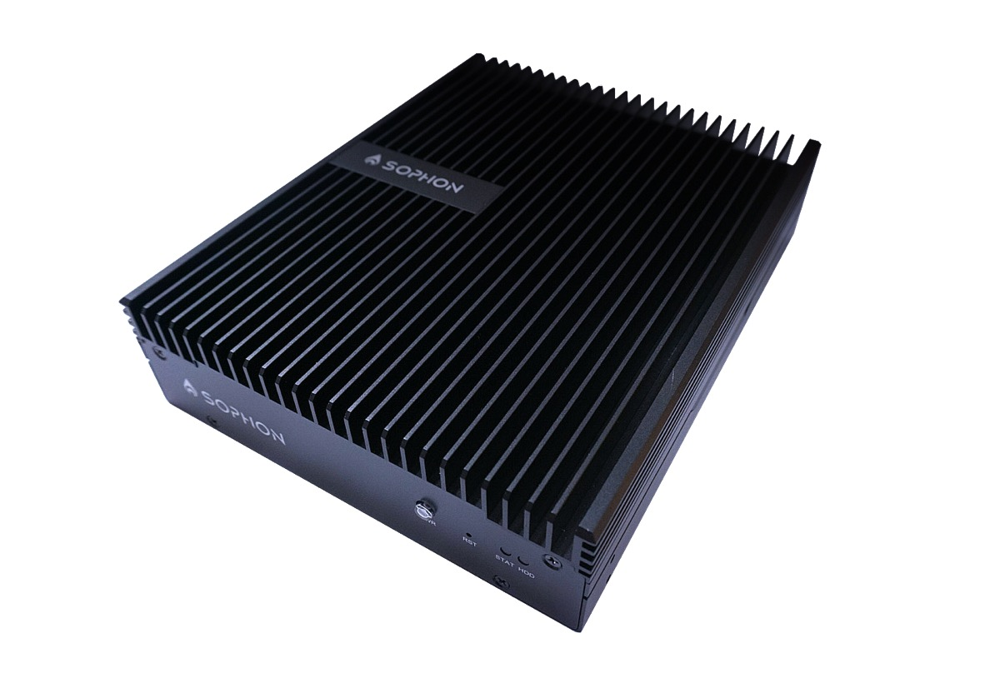

# SE5详细信息
微服务器SE5搭载算丰第三代TPU芯片BM1684，具备高性能、低功耗、环境适应性强等特点，通过搭配多样化深度学习算法，灵活应对智慧城市、智慧商业、智慧能源等场景，实现边缘侧的AI赋能。

## SE50221
### 超高性能
* 17.6TOPS峰值算力，高算力利用率
* 38路高清视频硬件解码能力
### 灵活部署
* 丰富的工业外设接口，宽温
* 支持无线回传，边缘本地存储
### 云边协同
* Docker容器化， Kubernetes扩展管理
* 云端模型更新与设备升级，可管可维 
### 产品规格
| 产品型号 | SE50221 |
| :---- | :---- |
| 主控CPU | 8核 ARM A53@2.3GHz |
| AI算力 | INT8 17.6 TOPS FP32 2.2 TFLOPS |
| 视频解码能力 | H.264 & H.265: 1080P @960fps |
| 视频解码分辨率 | 8192 * 8192 / 8K / 4K / 1080P / 720P / D1 / CIF |
| 视频编码能力 | H.264 & H.265: 1080P @50fps
| 视频编码分辨率 | 4K / 1080P / 720P / D1 / CIF |
| 图片解码能力 | JPEG: 480张/秒 @1080P |
| 图片解码最大分辨率 | 32768 * 32768 |
| 内存 | 12GB |
| eMMC | 32GB |
| 网络接口 | 10/100/1000Mbps自适应 *2 |
| 外部接口 | USB *2 / HDMI / SATA /RS-232 / RS-485 / TF / LTE|
| 电源接口 | 直流12V |
|工作温度| -20℃ ~ +60℃ |
|功耗典型值 | ~20W |
|防护等级| IP30|
| 结构尺寸 |长 * 宽 * 高 188 * 148 * 44.5 (mm)|
| 电源 | 2个 1300W 铂金电源 支持 1+1 冗余模式 |
| 工作温度 | 5°C ~ 35 °C |
| 操作系统 | Ubuntu / CentOS / Debian |
| 深度学习框架 | TensorFlow / PyTorch /Paddle / Caffe / ONNX / MXNet / Tengine /DarkNet|
## SE5-8-BA2-21
| 产品型号 | SE5-8-BA2-21 |
| :---- | :---- |
| 主控CPU | 8核 ARM A53@2.3GHz |
| AI算力 | INT8 10.6 TOPS FP32 1.3 TFLOPS |
| 视频解码能力 | H.264 & H.265: 1080P @240fps |
| 视频解码分辨率 | 8192 * 8192 / 8K / 4K / 1080P / 720P / D1 / CIF |
| 视频编码能力 | H.264 & H.265: 1080P @25fps
| 视频编码分辨率 | 4K / 1080P / 720P / D1 / CIF |
| 图片解码能力 | JPEG: 240张/秒 @1080P |
| 图片解码最大分辨率 | 32768 * 32768 |
| 内存 | 6GB |
| eMMC | 32GB |
| 网络接口 | 10/100/1000Mbps自适应 *2 |
| 外部接口 | USB3.0 *2 / HDMI *1 / TF *1 / RS-485 *2 / 开关量 *1 / 告警输入 *2 / 音频 *1|
| 电源接口 | 交流220V |
|工作温度| -20℃ ~ +70℃ |
|功耗典型值 | ~18W |
| 结构尺寸 |长 * 宽 * 高 185 * 170 * 43.6 (mm)|
| 工作温度 | 5°C ~ 35 °C |
| 操作系统 | Ubuntu / CentOS / Debian |
| 深度学习框架 | TensorFlow / PyTorch /Paddle / Caffe / ONNX / MXNet / Tengine /DarkNet|