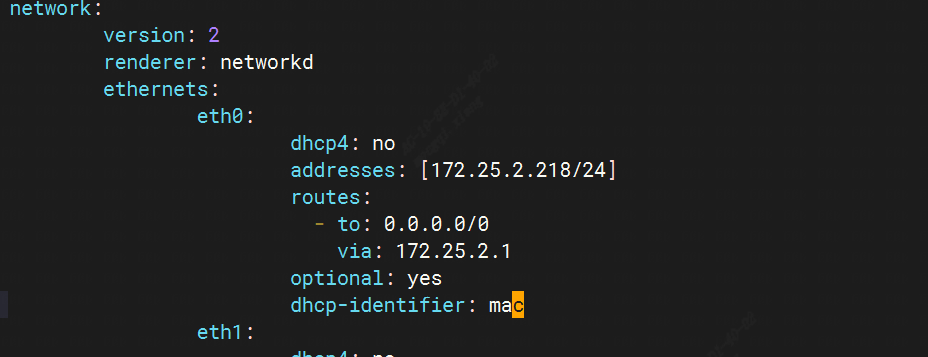

## 修改wan口IP方式（Ubuntu）

1.确定修改的IP地址

假设你电脑的IP是 172.25.92.76,当前网络中有个IP地址例如172.23.2.213无法ping通（当前网络中说明该IP没有被其他设备占用），则可选172.23.2.213固定成wan口地址。

2.修改wan口IP地址

```
cd /etc/netplan/
sudo vim 01-netcfg.yaml
```
  
```
sudo netplan apply
```


